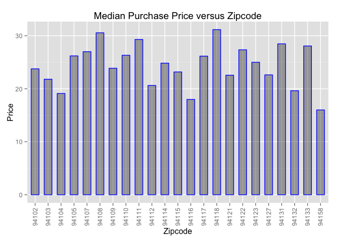

# Delivery_Challenge
ww44ss  
Oct  2014  


```
## 'data.frame':	59341 obs. of  6 variables:
##  $ pickup_zipcode    : int  94102 94110 94110 94109 94114 94114 94107 94115 94109 94117 ...
##  $ purchase_price    : num  79.16 9.72 9.65 24.74 11.9 ...
##  $ customer_uuid     : Factor w/ 13969 levels "0004fea6-6c44-41aa-8276-d496aa16b6c5",..: 3507 5439 1565 7947 3035 13807 9447 13809 1865 6529 ...
##  $ pickup_uuid       : Factor w/ 3154 levels "00199bb9-1b4e-4510-b1f2-7fb73f801034",..: 35 778 1137 3051 671 2541 2252 995 1882 1076 ...
##  $ avg_courier_rating: Factor w/ 9 levels "4.3","4.4","4.5",..: 6 6 5 8 8 5 6 8 6 8 ...
##  $ Status            : Factor w/ 1 level "Delivery_Complete": 1 1 1 1 1 1 1 1 1 1 ...
```

```
##   pickup_zipcode purchase_price avg_courier_rating
## 1          94102          79.16                4.8
## 2          94110           9.72                4.8
## 3          94110           9.65                4.7
## 4          94109          24.74                  5
## 5          94114          11.90                  5
## 6          94114          39.71                4.7
```

##Deliveries per Zipcode


```r
##This seciton counts deliveries by zipcode and plots the result

require(xtable)
```

```
## Loading required package: xtable
```

```r
require(ggplot2)
```

```
## Loading required package: ggplot2
```

```r
#find frequencies

        ##Grab the zipcode data and use table to count
        deliveries <- as.data.frame(table(delivery_data$pickup_zipcode))

        #rename columns descriptively
        colnames(deliveries)<-c("pickup_zipcode", "freq")

        ##Put zipcodes as characters for later use
        deliveries$pickup_zipcode <- as.character(deliveries$pickup_zipcode)
   
        ##plot the data
        P1 <- ggplot(deliveries, aes(x=factor(pickup_zipcode), y=freq))
        P1<- P1+geom_point(size=4, colour="blue", alpha=.7)  ##point aesthetics
        P1<- P1+xlab("zipcode")+ylab("deliveries")+ggtitle("Deliveries versus Zipcode (All)")
        P1<- P1+theme(axis.text.x = element_text(angle = 90, vjust = 0.5, hjust=1))

##print the plot of deliveries per zipcode
        print(P1)
```


##Top-Delivery Zipcodes


```r
        ##create table output of top zip codes

        ##sort data by deliveries
        deliv_sorted<-deliveries[with(deliveries, order(-freq)),]       ##sort by order frequency 
        ##this next part has to do with the behavior of R
                ##First have to conver the data back from character to integer
                ##and then bind individual columns together again.
                deliv_sorted<-cbind(as.integer(deliv_sorted$pickup_zipcode), as.integer(deliv_sorted$freq))
        ##assign column names      
        colnames(deliv_sorted)<-c("pickup_zipcode", "number_deliveries")  
        ##turn into a data frame
        deliv_sorted<-as.data.frame(deliv_sorted)

        print(deliv_sorted, row.names=FALSE)
```

```
##  pickup_zipcode number_deliveries
##           94110              8679
##           94103              6917
##           94123              6461
##           94109              5693
##           94115              4319
##           94102              4069
##           94117              3633
##           94107              3544
##           94114              3211
##           94133              1890
##           94118              1774
##           94111              1656
##           94105              1562
##           94122              1517
##           94108              1014
##           94132               994
##           94121               404
##           94131               374
##           94116               302
##           94104               282
##           94158               252
##           94112               244
##           94127               219
##           94124               181
##           94539                39
##           94903                30
##           94129                23
##           94134                17
##           94101                15
##           94199                11
##           94143                10
##           94939                 2
##           95404                 2
##           94017                 1
```


###Filter for High Delivery ZipCodes > 200

```r
##This seciton first subsets the sorted zipcodes by delivery data (deliv_sorted) 
##for instances greater than 200,
##then creates a table fo those zipcodes
##and subsets the original data based on that set
##it results the data a delivery_data2

        ##Filter the data
        deliv_sorted2<-deliv_sorted[deliv_sorted$number_deliveries>200,]

        ##Subset the data

        delivery_data2<-delivery_data[delivery_data$pickup_zipcode %in% deliv_sorted2$pickup_zipcode,]
```

##Zipcode and Price Volume Correlation  


```
## Loading required package: plyr
```

```
##  pickup_zipcode less_than_60 btw_60_and_120 above_120
##           94102         3648            301       120
##           94103         6216            508       193
##           94104          247             25        10
##           94105         1261            246        55
##           94107         2957            452       135
##           94108          778            192        44
##           94109         5092            456       145
##           94110         7698            857       124
##           94111         1344            246        66
##           94112          226             14         4
##           94114         2850            300        61
##           94115         3970            311        38
##           94116          293              5         4
##           94117         3313            260        60
##           94118         1467            258        49
##           94121          369             27         8
##           94122         1335            143        39
##           94123         5909            495        57
##           94127          198             18         3
##           94131          330             38         6
##           94132          930             44        20
##           94133         1649            205        36
##           94158          236             12         4
```

###

###Plot of Purchase Price Data by Zipcode


```
## Warning: Removed 2146 rows containing non-finite values (stat_ydensity).
```


This plot is really informative.

###Purchase Price Statistics by Zip Code  

 

